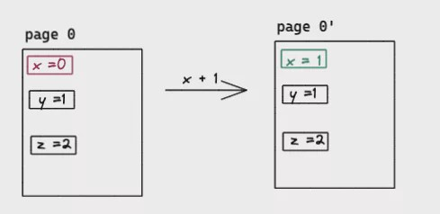
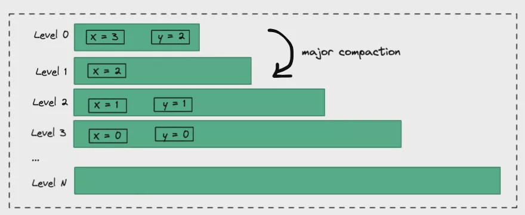
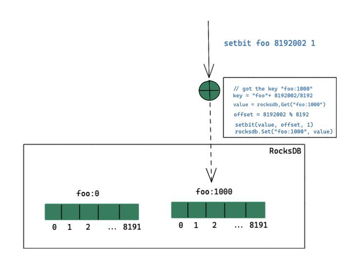

Most developers should be familiar with bitmap, in addition to the storage implementation for the bloom filter, and many databases also provide bitmap type indexes. For memory storage, the bitmap can be regarded as the special type of sparse bit array, which would not cause the read-write amplification issue (means read/write bytes far more than the request). While Redis supports bit-related operations on string types, it is a big challenge for disk KV-based storage like [Kvrocks](https://github.com/apache/incubator-kvrocks). So this article mainly discusses "**How to reduce disk read/write amplification on RocksDB**".

<!--truncate-->

## Why amplification occurs

Amplification mainly comes from two aspects:

* The hardware-level requires the smallest reading and writing unit
* How we organize the data distribution on the software-level

Take SSD as an example, the smallest unit of reading/writing operation was the page (commonly 4KiB/8KiB/16KiB), and it would read or write one page even the request size was 1byte. Moreover, the way of SSD modification was Read-Modify-Write instead of in-place, which means SSD would read the page content and modify then write it out to another page, the old page would be reclaimed by GC. Similar to the following:



As we can see, a large random io was very unfriendly to the SSD disk, except for the performance issue, frequent erasing and writing will also seriously lead to the life of the SSD (random reads and writes are also unfriendly to HDDs, requiring constant seek and addressing). LSM-Tree alleviates such problems by changing random writes into sequential batch writes.

The read-write amplification at the software level mainly comes from the data organization method, and the degree of read-write amplification brought about by different organization methods will also vary greatly. Take RocksDB as an example here, RocksDB is Facebook based on Google LevelDB which enrichments the multi-threading, Backup and Compaction, and many other very useful functions. To solve the problem of the disk write amplification, it also brings some space enlargement problems. Let's take a brief look at how LSM-Tree organizes data:



LSM-Tree would create a new entry per write. For example in the above picture, the variable X is written 4 times successively, which are 0, 1, 2, 3. From the single variable X side, it was caused 4 times space amplification, those old spaces would be reclaimed on the background compaction. Similarly, deletion is achieved by inserting a record whose value is empty. The space size of each layer of LSM-Tree increases layer by layer. When the capacity reaches the limit, it will trigger compaction to merge to the next layer, and so on. Assuming that the maximum storage size of Level 0 is M Bytes, it increases layer by layer by 10 times and the maximum is 7 layers. Theoretically, the space enlargement is about 1.111111 times. Calculated as follows:

```text
amplification ratio = (1 + 10 + 100 +1000 + 10000 + 100000 + 1000000) * M / (1000000 * M)
```

However, the magnification space rate is much larger than this theoretical value since the last layer generally cannot reach the maximum value. It is also mentioned in the RocksDB documentation. For details see also RockDB's blog ["Dynamic Level Size for Level-Based Compaction"](https://rocksdb.org/blog/2015/07/23/dynamic-level.html).

In addition, since RocksDB reads and writes are all based on key-value, the larger the value, the greater the read-write amplification may be. For example, suppose there is a JSON with a Value of 10 MiB. If you want to modify a field in this key, you need to read the entire JSON, modify and write it back again, which will cause huge read-write amplification. The paper ["WiscKey: Separating Keys from Values ​​in SSD-conscious Storage"](https://www.usenix.org/system/files/conference/fast16/fast16-papers-lu.pdf) that optimizes the large Key-Value of LSM-Tree by separating key-value to reduce the write amplification problem caused by Compaction. The [titan](https://github.com/tikv/titan) project of TiKV is based on WiscKey paper to optimize RocksDB's write amplification in large key-value scenarios. RocksDB also implements this function in the community version, but it is still in an experimental stage.

## Implement bitmap on RocksDB

Kvrocks is disk storage compatible with the Redis protocol implemented on RocksDB. It needs to support the bitmap data structure, so needs to implement the bitmap on RocksDB. In most scenes, the bitmap is used as sparse arrays, which means the offset written should be random, for the first time maybe 1, and the next offset maybe 1000000000 or more. Therefore, the implementation will face the above-mentioned amplification issue.

A simple way is to regard the entire bitmap as a value, and read the value into the memory and then write it back when writing. Although this implementation is very simple, it would cause seriously amplification when the value was huge. In addition to the problem of effective space utilization, it may directly cause the entire service to be unavailable since we need to read and write back the entire value. Bitmap in Pika is such an implementation, but the maximum value is limit to128 KiB. Limit the value size can avoid the above-mentioned extreme cases, but it will greatly affect the user scenes of bitmap.

Since we know that the core problem is caused by a single key-value that is too large, the most direct way is to split the bitmap into multiple key-values, and control the single key-value size within a reasonable range, so the amplification is relatively under control. In the current implementation of Kvrocks, each key-value is divided into 1 KiB(8192 bits) . The algorithm diagram is as follows:



Take `setbit foo 8192002 1` as an example, the implementation steps are:

* Calculate the key corresponding to the offset of `8192002`, because Kvrocks uses a value of 1 KiB, so the number of the key is `8192002/(1024*8)=1000`, so you can know the bit should be stored in the subkey `foo1000`.
* Then get the value corresponding to this key from RocksDB and calculate the offset in the segment, `8192002%8192` is equal to `2`, and then set the bit with the offset of 2 to 1.
* Finally write the entire value back to RocksDB

A key point of this implementation is only read-write the limit part of the bitmap we need. Assuming that we have only executed setbit twice, `setbit foo 1 1` and `setbit foo 8192002 1`, then there will only read and write two keys `foo:0` and `foo:1000` in RocksDB, and the actual read-value size is only 2 KiB in total. It can be perfectly adapted to the sparse array scene like the bitmap, and will also not cause the problem of space enlargement due to sparse writing.

> This idea is also similar to Linux's virtual memory/physical memory mapping strategy. For example, we request to malloc for 1GiB, and the operating system only allocates a piece of virtual memory address space. The physical memory was allocated when it is actually written will it trigger a page fault interrupt. That is, if the memory page has not been written, read-only will not cause physical memory allocation.

GetBit is similar. It first calculates the key where the offset is located, and then reads the key from RocksDB.

* If not exist, means that segment has not been written, returns 0 directly.
* If exists, read the Value and return the value of the corresponding bit.

In addition, the actual key-value size is also determined by the largest offset currently written. It would NOT always create a 1024 KiB key-value when there is a write. This can also help to optimize the read-write amplification problem within a single key-value in some degree. You can read [the source code of bitmap](https://github.com/KvrocksLabs/kvrocks/blob/unstable/src/redis_bitmap.cc) for more details.

## Summary

It can be seen that to achieve the same thing in memory and disk was entirely different, the challenges are completely different. For disk-type services, it MUST continuously optimize the random read and write and space amplification issues. Familiar with the software was not enough, also requires to understand the hardware internal.
