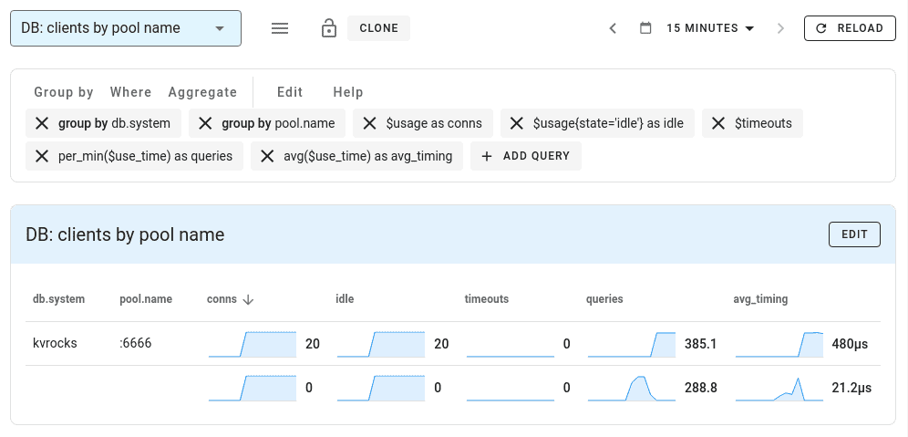
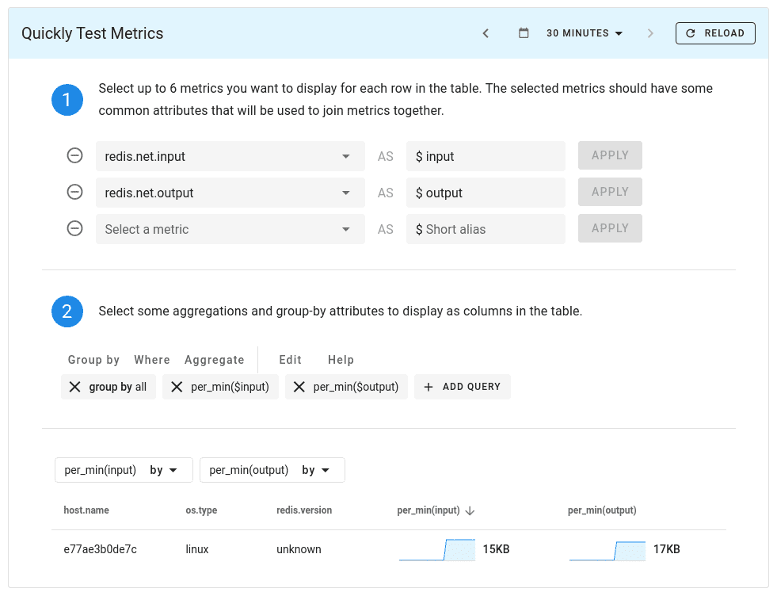
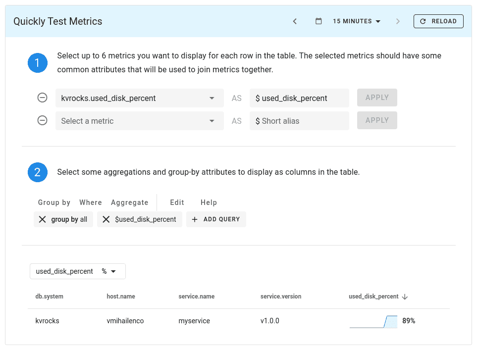

Learn how to use go-redis client to get started with Apache Kvrocks, a distributed key-value NoSQL database.

<!--truncate-->

## What is Kvrocks?

[Apache Kvrocks](https://kvrocks.apache.org/) is a distributed key-value NoSQL database that uses RocksDB as a storage engine and is compatible with Redis protocol.

You can use Kvrocks as a drop-in replacement for Redis to store data on SSD, reducing storage costs and increasing capacity. For example, imagine taking one of the many existing Redis-based job queues and using them with Kvrocks and SSD storage.

Kvrocks supports most [Redis commands](/docs/supported-commands) including the `watch` command starting from v2.4.0. [Kvrocks Cluster](/docs/cluster) and [replication](/docs/replication) are available as well.

## Getting started with Kvrocks

You can launch Kvrocks using Docker:

```shell
docker run -it -p 6666:6666 apache/kvrocks
```

And start using it right away:

```text
redis-cli -p 6666

127.0.0.1:6666> get foo
(nil)
127.0.0.1:6666> set foo bar
OK
127.0.0.1:6666> get foo
"bar"
```

You can also [build](https://github.com/apache/kvrocks#build-and-run-kvrocks) Kvrocks with GCC yourself.

## Connecting to Kvrocks from Go

Since Kvrocks uses Redis-compatible protocol, you can use your favorite Redis client to work with Kvrocks, for example, [Go Redis client](https://redis.uptrace.dev/guide/go-redis.html):

```go
package main

import (
	"context"
	"github.com/redis/go-redis/v9"
)

func main() {
	ctx := context.Background()

	rdb := redis.NewClient(&redis.Options{
		Addr: "localhost:6666",
	})

	err := rdb.Set(ctx, "key", "value", 0).Err()
	if err != nil {
		panic(err)
	}

	val, err := rdb.Get(ctx, "key").Result()
	if err != nil {
		panic(err)
	}
	fmt.Println("key", val)
}
```

Pipelines, pub/sub, and even Lua scripts are working as well:

```go
var incrBy = redis.NewScript(`
local key = KEYS[1]
local change = ARGV[1]

local value = redis.call("GET", key)
if not value then
  value = 0
end

value = value + change
redis.call("SET", key, value)

return value
`)
```

You can then run the script like this:

```go
keys := []string{"my_counter"}
values := []interface{}{+1}
num, err := incrBy.Run(ctx, rdb, keys, values...).Int()
```

## Monitoring Kvrocks

Monitoring Kvrocks performance is crucial to ensure optimal operation and identify any potential bottlenecks or issues.

OpenTelemetry provides instrumentation libraries and integrations for monitoring Kvrocks using its unified observability framework.

### What is OpenTelemetry?

[OpenTelemetry](https://opentelemetry.io/) is an open-source observability framework designed to standardize and simplify the collection, analysis, and export of telemetry data

OpenTelemetry allows developers to collect and export telemetry data in a vendor agnostic way. With OpenTelemetry, you can instrument your application once and then add or change vendors without changing the instrumentation, for example, here is a list [DataDog competitors](https://uptrace.dev/blog/datadog-competitors.html) that support OpenTelemetry.

### What is Uptrace?

Uptrace is an [OpenTelemetry APM](https://uptrace.dev/get/opentelemetry-apm.html) that supports [distributed tracing](https://uptrace.dev/opentelemetry/distributed-tracing.html), metrics, and logs. You can use it to monitor applications and set up automatic alerts to receive notifications via email, Slack, Telegram, and more.

Uptrace stores telemetry data in ClickHouse database. ClickHouse is an open source column-oriented database management system that is designed to process large volumes of data in real-time and to provide fast analytics and reporting capabilities.

### Monitoring Kvrocks client

You can use OpenTelemetry and Uptrace together to monitor Kvrocks performance using the go-redis instrumentation:

```go
import "github.com/redis/go-redis/extra/redisotel/v9"

rdb := redis.NewClient(&redis.Options{
	Addr: ":6666",
})

if err := redisotel.InstrumentTracing(rdb, redisotel.WithDBSystem("kvrocks")); err != nil {
	panic(err)
}
if err := redisotel.InstrumentMetrics(rdb, redisotel.WithDBSystem("kvrocks")); err != nil {
	panic(err)
}
```

Once the data reaches Uptrace, it will generate the following dashboard for you:



Because OpenTelemetry provides a vendor-agnostic approach, it allows you to choose an [OpenTelemetry backend](https://uptrace.dev/blog/opentelemetry-backend.html) that best suits your requirements, for example, Jaeger or Zipkin.

### Monitoring Kvrocks server

You can also configure [OpenTelemetry Redis receiver](https://uptrace.dev/get/monitor/opentelemetry-redis.html) to monitor Kvrocks:

```yaml
receivers:
  redis/kvrocks:
    endpoint: "kvrocks:6666"
    collection_interval: 10s
```

The receiver works by parsing the output of `INFO` command and produces a number of useful metrics:



See [GitHub example](https://github.com/uptrace/uptrace/tree/master/example/kvrocks) for details.

You can also export the collected metrics to Prometheus using [OpenTelemetry Prometheus bridge](https://uptrace.dev/opentelemetry/prometheus-metrics.html)

### Custom metrics

Using OpenTelemetry Metrics API, you can even create custom Kvrocks metrics. For example, the following function parses `used_disk_percent` to create `kvrocks.used_disk_percent` metric:

```go
var re = regexp.MustCompile(`used_disk_percent:\s(\d+)%`)

func monitorKvrocks(ctx context.Context, rdb *redis.Client) error {
	mp := global.MeterProvider()
	meter := mp.Meter("github.com/uptrace/uptrace/example/kvrocks")

	usedDiskPct, err := meter.AsyncFloat64().Gauge(
		"kvrocks.used_disk_percent",
		instrument.WithUnit("%"),
	)
	if err != nil {
		return err
	}

	return meter.RegisterCallback(
		[]instrument.Asynchronous{
			usedDiskPct,
		},
		func(ctx context.Context) {
			pct, err := getUsedDiskPercent(ctx, rdb)
			if err != nil {
				otel.Handle(err)
			}
			usedDiskPct.Observe(ctx, pct, semconv.DBSystemKey.String("kvrocks"))
		},
	)
}

func getUsedDiskPercent(ctx context.Context, rdb *redis.Client) (float64, error) {
	info, err := rdb.Info(ctx, "keyspace").Result()
	if err != nil {
		return 0, err
	}

	m := re.FindStringSubmatch(info)
	if m == nil {
		return 0, errors.New("can't find used_disk_percent metric")
	}

	n, err := strconv.ParseInt(m[1], 10, 64)
	if err != nil {
		return 0, err
	}

	return float64(n) / 100, nil
}
```

The metric looks like this in Uptrace:



See [OpenTelemetry Go Metrics API](https://uptrace.dev/opentelemetry/go-metrics.html) for details.

## Useful links

- [Getting started with Kvrocks](/docs/getting-started)
- [Golang Redis](https://redis.uptrace.dev/guide/go-redis.html)
- [Get started with Uptrace](https://uptrace.dev/get/get-started.html)
