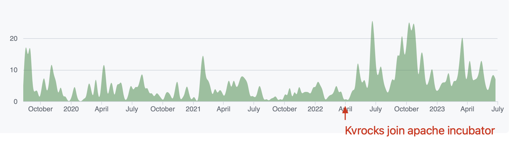

[Wilmington, DE – June 28, 2023 – The Apache Software Foundation(ASF) announced Kvrocks has graduated from the incubator as a Top-Level-Project.](https://news.apache.org/foundation/entry/the-apache-software-foundation-announces-new-top-level-project-apache-kvrocks) Means that the Kvrocks community has met the Apache Foundation's requirements in terms of Apache Way practices,  diversity, and open communication. Graduation is just a new starting point, and much work is still needed for the long-term health of the community.

<!--truncate-->

### Kvrocks Overview & Advantages

Kvrocks is a distributed key value NoSQL database that uses RocksDB as storage engine and is compatible with Redis protocol. Users can decrease the cost of memory and increase the capacity compared to Redis.

### Kvrocks Feature Highlights

- Redis Compatible: Support common Redis data types and commands;
- Namespace: Similar to Redis DB but equipped with a token per namespace;
- Replication: Async replication using WAL of RocksDB;
- High Availability: Support Redis sentinel to failover when master failed; and
- Cluster: Centralized management but accessible via any Redis cluster client.

### ADDITIONAL RESOURCES

- GitHub: [https://github.com/apache/kvrocks](https://github.com/apache/kvrocks)
- Download: [https://kvrocks.apache.org/download](https://kvrocks.apache.org/download)
- Docs: [https://kvrocks.apache.org/](https://kvrocks.apache.org/)
- Contribute: [https://kvrocks.apache.org/community/contributing](https://kvrocks.apache.org/community/contributing)

Since being open sourced in 2019, Kvrocks has served as an alternative replacement for Redis in massive data scenarios. Many companies are deploying and using Kvrocks in the production environment, such as Baidu, Circl.lu, Ctrip, Meitu, Opera, U-Next and Xueqiu, among others.

To serve users better, Kvrocks plans to add Kubernetes deployment support, the controller to make the cluster easier to maintain and operate, and add more data structures for fulfilling the user requirements.

### Incubation processes

Kvrocks joined the Apache Incubator at the end of April 2022 and officially became an Apache top-level project in June 2023. There has been a significant increase in community activity

1. The number of contributors has increased from **27** to **82**
2. Release **4** minor versions during incubation: 2.1.0 / 2.2.0 / 2.3.0 / 2.4.0
3. Created **900+** Pull Requests
4. Created Created **300+** Issues
5. Nominated **4** Committers: PragmaTwice / Torwig / Ruixiang Tan / Xiaobiao Zhao, and PragmaTwice and Torwig has became PMC member now.

### Our Users

It's worth noting that the majority of Kvrocks community contributors and committers are from the community users. In addition to using, they also help make the community better in their own way. Huge thanks to every user, contributor and committer.

### Mentor & PMC Words

**@Liang Chen (Champion, Apache Member, Apache Incubator Mentor):** Congratulations to Kvrocks for becoming an ASF Top Project. Kvrocks community has become an outstanding NoSQL DB open source project in the Big Data ecosystem after more than 1 year of hard work and incubation in accordance with the Apache Way.

**@Xiaoqiao He (Mentor, Apache Member, Apache Incubator Mentor):** Congratulations to Kvrocks on its successful graduation from the Apache Incubator. It was a pleasure to participate and witness Kvrocks successfully apply the Apache Way to community operations and project evolution after more than a year of incubation run and graduation. Graduation means a new beginning, I wish Kvrocks continues to build and prosper the data ecosystem, and look forward to Kvrocks creating more value.

**@tison (Mentor, Apache Member, Apache Incubator Mentor):** Congratulations to Kvrocks, my first mentor-incubated project, for graduating from the incubator. I'm excited to help the Kvrocks community grow under the guidance of The Apache Way, and to see how quickly the diversity of Kvrocks users and developers has grown over the past year. Graduating from the incubator is a small step for Kvrocks, but also a big step for all community members. Thank you and congratulations to everyone who has contributed to the development of Kvrocks!

**@Yaroslav Stepanchuk (Kvrocks PMC Member): **It has been approximately a year since I first joined the Kvrocks community. From the very beginning, I was welcomed into a supportive environment, which made it incredibly easy for me, a complete newcomer to open-source, to make my initial contributions. Witnessing the project's journey and observing its current state fills me with pride. The fact that Kvrocks has successfully graduated from the Apache Incubator is a remarkable accomplishment that can be credited to all the contributors and users involved in the project. Reflecting on this milestone, I am truly amazed by the power of open-source collaboration. I firmly believe that the project's graduation will provide an additional boost, serving as a source of inspiration and leading to the expansion of our already exceptional community.

**@Hulk Lin (Kvrocks PMC Member):** As one of the community maintainers, I am very happy that Kvrocks has become a top project in Apache after more than a year of incubation, and I am honored to work with many excellent contributors from home and abroad to maintain the project and the community. Graduation is just a new starting point, and I'm looking forward to having more great people join us.

**@Yuan Wang (Kvrocks PMC Member):** We're excited to graduate from the incubator and are happy to be working on Kvrocks with great contributors in the community, and we'll continue to pay attention to the feedback from the community to polish and optimize the product to make Kvrocks more stable and easy to use.

**@PragmaTwice (Kvrocks PMC Member):** The ASF community's volunteer model and the community over code credo have helped me understand more about open source and make me feel very comfortable in the community. Coincidentally, Kvrocks graduated almost at the same time as me, so congratulations to me and the community!

**@DongHui Liu (Kvrocks PMC Member):** We are happy to witness the whole journey of Kvrocks from the initial open source to the incubation in Apache to the successful graduation, and we are honored to maintain the Kvrocks project with the excellent contributors in the community. Graduation is an important milestone and the beginning of a new journey, we will continue to focus on our product capabilities and make Kvrocks better for the community. Good luck with Kvrocks!

### Thanks

- Thanks to the great efforts of every contributor, to make it possible for Kvrocks becoming a top project;
- Thank you to every Release Manager and to those who have helped Kvrocks release process. It is a great opportunity for community members to learn and practice the Apache Way from the release process;
- Thanks to the incubator mentors for their guidance and help in helping community members understand Apache's operating philosophy and code of conduct. In addition to being heavily involved in code development and community building;
- Finally, thank you to all users, your feedback and suggestions have had a significant impact on the development of Kvrocks, and this is what keeps the community going!

### The End

Apache Kvrocks still has a lot of room for development in terms of community influence and feature iteration, and we hope the community can keep an open and friendly community atmosphere based on the premise of the Apache Way, while attracting more excellent contributors. In the future, in addition to supporting more data types, we will continue to optimize the experience of using Kvrocks in container environments and simplify the operation and management of clusters.
