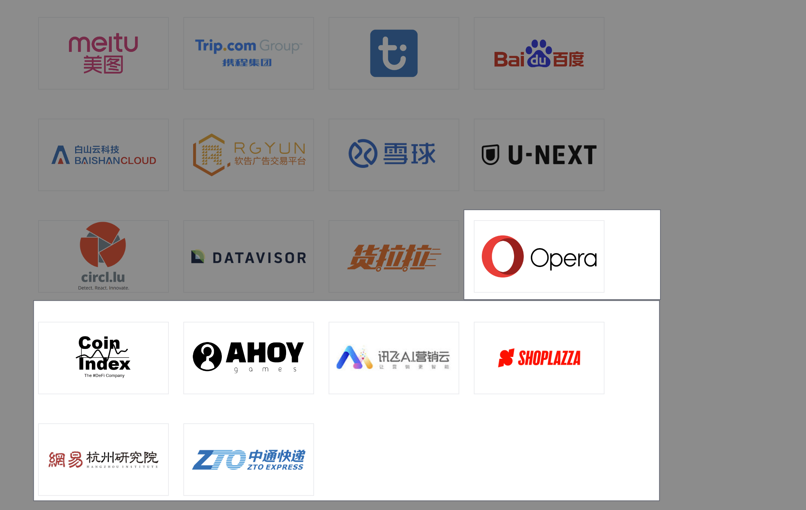

The year 2023 is a small milestone for the community in open source, and it is also a new starting point. **Kvrocks successfully graduated from the incubator to become an Apache top-level project in June, which is a great affirmation for the community's health and sustainability**. At the same time, there are also some exciting progress in the project and community.

Before we start, we would like to thanks all the contributors and users who have been supporting Apache Kvrocks. We can't make it without you!

<!--truncate-->

### Project Retrospective

We collected a lot of feedback from users and developers in the discussion: [2023 Planning(Want your feedback)](https://github.com/apache/kvrocks/discussions/1226), some of them have been resolved in 2023, and some of them are still in the plan list:

**The key progresses in 2023:**

- JSON data structure
- BloomFilter data structure
- Watch/Unwatch command
- Lua Functions
- Replication with TLS
- 65 bits expire time and size
- Allow to use `LOAD RDB` command to load Redis RDB file
- Allow to dynamically adjust the number of Worker threads
- Enable Namespace replication
- Support RESTORE command

**What we are still working on:**

- RESP3 protocol, more information can be found in [Tracking issue: Support RESP3 in Kvrocks](https://github.com/apache/kvrocks/issues/1980)
- Kvrocks in Kubernetes, [kvrocks-operator](https://github.com/RocksLabs/kvrocks-operator) is ready to test now, but still need more work to make it production-ready
- Controller to manage cluster, the API part of [kvrocks-controller](https://github.com/RocksLabs/kvrocks-controller) is finished, but we belive it's not enough of users before UI part is ready

**What still in the backlog:**

- Allow to use the Raft protocol for replication
- HyperLogLog/RedisGraph data structure
- Semi-sync replication
- Client-side caching

## Community

In the past year, in addition to operating based on the principle of "Community over Code" of the Apache Foundation, the community maintenance also adheres to the attitude of openness, transparency, openness, inclusiveness, freedom and equality towards everyone.

In 2023, the community has many things worth sharing:

- Successfully graduated from the incubator to become an Apache top-level project in June
- Released a total of `6` versions from **2.3.0 - 2.7.0**
- Voted for `5` new Committers, they are: xiaobiaozhao / mwish / Aleks Lozovyuk / binbin / yangshixi
- The total number of contributors exceeded `100+`, which increased by `41` compared to 2022
- Merged PR total number [500+](https://github.com/RocksLabs/kvrocks-operator)
- In terms of community communication groups, the number of WeChat groups is `450+`, and the number of Slack is `250+`

## New Logo

The number of users in the community has increased by `7` organizations, including Opera / iFlytek / SHOPLAZZA / Netease Hangzhou Research Institute / ZTO Express / Coin Index and AHOY.

Thanks to the above users for their use and active feedback, and welcome more users to leave your usage scenarios in GitHub Issue: [Who is using Kvrocks?](https://github.com/apache/kvrocks/issues/414)

## 2024 Planning

In the past few years, the annual plan of Kvrocks has also maintained the principle of openness and transparency, and I hope to hear the voices of users and developers. Therefore, the community is open to collect needs and feedback from everyone.

Please don't hesitate to leave comments in [2024 Planning(Want your feedback)](https://github.com/apache/kvrocks/discussions/1974) if you have any ideas or suggestions.
