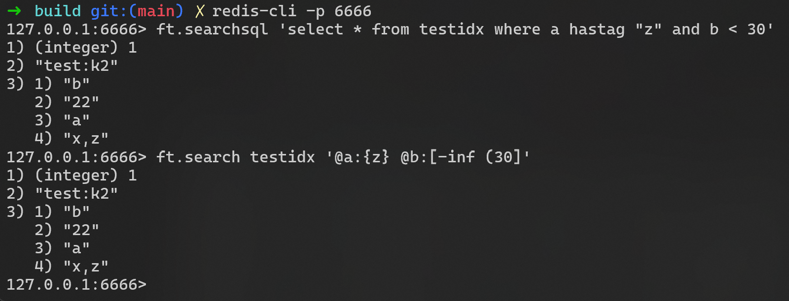
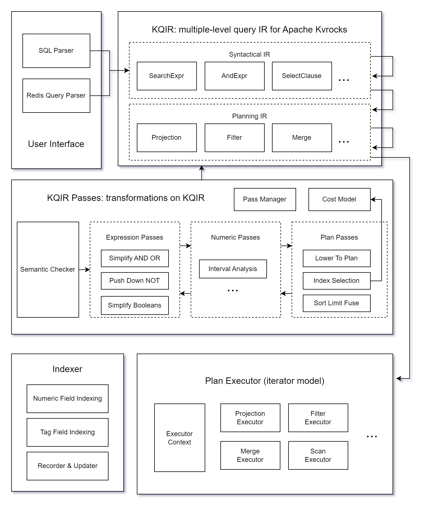

## Intro

TL;DR:



Pretty cool, right? Let's dive in!

<!--truncate-->

### Apache Kvrocks

[Apache Kvrocks](https://kvrocks.apache.org/) is a [Redis](https://redis.io/)-compatible database built on [RocksDB](https://rocksdb.org/).

It supports [the RESP protocol](https://redis.io/docs/latest/develop/reference/protocol-spec/) (version 2 and 3) and [a wide range of Redis commands](/docs/supported-commands), encompassing core data structures like Strings, Sets, Hashes, Sorted Sets, Stream, GEO, as well as Lua Scripts, Transactions, [Functions](https://redis.io/docs/latest/develop/interact/programmability/functions-intro/) and even [BloomFilter](https://redis.io/docs/latest/develop/data-types/probabilistic/bloom-filter/), [JSON](https://redis.io/docs/latest/develop/data-types/json/) from the Redis Stack.

Unlike Redis which stores data in memory, Kvrocks persists data on disk for improved storage capabilities without being constrained by machine memory limit.

### The capability to query

In recent decades, NoSQL databases have gained prominence over traditional databases for their superior performance, scalability, and versatility across various industries.

However, many users are reluctant to completely forego the essential features of SQL databases just for performance reasons.
These include ACID transactions, expressive query capabilities inherent in SQL, as well as optimization and abstraction possibilities offered by structured data and relational algebra.
Consequently, a new category of databases known as NewSQL has emerged gradually.

Kvrocks is a NoSQL database.
While not classified as NewSQL, Kvrocks aims to strike a balance between NoSQL and NewSQL paradigms:
It endeavors to uphold the high performance associated with NoSQL while bolstering transactional guarantees alongside supporting more expressive query methods.

### RediSearch?

[RediSearch](https://github.com/RediSearch/RediSearch) is a Redis module that enhances Redis with query, secondary indexing, and full-text search functionalities. 
While [its Redis commands](https://redis.io/docs/latest/operate/oss_and_stack/stack-with-enterprise/search/commands/) begin with `FT.` (i.e. full text), it goes beyond just full-text search.

In fact, it is Redis moving closer to SQL databases:
RediSearch enables users to create structured schemas on existing Redis JSON or HASH data for index building.
Its schema supports [various field types](https://redis.io/docs/latest/develop/interact/search-and-query/basic-constructs/field-and-type-options/) such as numeric, tag, geo, text, and vector - the latter two are utilized for full-text and vector searches.
Instead of SQL support, RediSearch provides [a unique query syntax](https://redis.io/docs/latest/develop/interact/search-and-query/advanced-concepts/query_syntax/) known as the RediSearch query language.

RediSearch finds applications in various fields.
One recent application involves utilizing its vector search feature to develop retrieval-augmented generation (RAG). For instance, [LangChain](https://www.langchain.com/) utilizes Redis as one of its vector database.
If Kvrocks can be compatible with RediSearch, it could benefit from these ecosystem from RediSearch.

### SQL?

RediSearch uses a unique syntax for queries, but there are some issues to consider:

Firstly, RediSearch's schema (known as an index created with `FT.CREATE`) can be likened to a table in an SQL database. Its query syntax also aligns semantically with SQL queries.
Given this similarity, supporting SQL should not pose significant challenges; why not incorporate it?

Secondly, SQL enjoys broader usage and is familiar to more individuals. It is simpler to grasp and learn at the syntax level. While developers may need time to understand RediSearch query syntax when using it, adapting to a new SQL database typically requires less effort. Furthermore, SQL offers robust support for various query features, enhanced expressive capabilities (like JOINs, subqueries, aggregation), and greater scalability.

Lastly, RediSearch query syntax exhibits certain idiosyncratic designs and historical influences. For instance, the operator precedence of AND and OR (represented by space and `|` operator in RediSearch queries) varies across different dialect versions (dialect 1 vs dialect 2). These design choices might lead users to place more trust in established query languages.

Considering these factors leads us to believe that incorporating support for SQL as a querying language would also be advantageous.

## How we support both?



To introduce SQL capability to Kvrocks, we need to design a robust architecture with scalability, maintainability, and strong query planning and optimization features.

We plan to accomplish this through [KQIR](https://github.com/apache/kvrocks/tree/unstable/src/search). In the context of Kvrocks, KQIR stands for both:
1. The complete query engine, covering frontend language parsing, query optimization and execution, etc.
2. An intermediate language (IR) that traverses the entire query engine.

### KQIR: a multiple-level IR

To support both SQL and RediSearch queries simultaneously, an intermediate language is needed to handle them consistently in subsequent processes without concern for the user's input language.

We have developed parsers for a subset of MySQL syntax and RediSearch queries, converting the resulting syntax tree into KQIR.

And KQIR is a multi-level IR that can represent query structures at various levels during optimization.
The initial transformation from the syntax tree results in Syntactical IR, a high-level representation of certain syntactic expressions.
As it undergoes processing by an IR optimizer, KQIR evolves into Planning IR, a low-level representation used to express query execution plans within the query engine.

Additionally, we will conduct semantic checks on the IR before optimization to ensure that the query is semantically correct.
This includes verifying that it does not include any undefined schemas or fields and uses the appropriate field types.

### IR Optimizer

The KQIR optimizer consists of multiple passes, [a concept borrowed from LLVM](https://llvm.org/docs/Passes.html).
Each pass takes IR as input, conducts analysis and modifications, and generates a new IR.

Currently, the optimizer's passes are categorized into three main groups:
- expression passes for optimizing logical expressions like `AND`, `OR`, `NOT` operators;
- numeric passes for optimizing numerical comparisons with an interval analysis (i.e. analyze the mathematical properties of numerical comparisons in terms of intervals) to enhance query optimization by eliminating unnecessary comparisons or improving comparison expressions;
- planning passes for converting syntactical IR to planning IR and enhancing query plans through a cost model that selects optimal indexes and removes unnecessary sortings.

Pass execution order is controlled by the pass manager.
A pass may run multiple times at different stages to simplify individual passes by combining them.

### Plan Executor

The KQIR plan executor is built on the Volcano model.

Once the IR optimizer finishes all optimizations, the resulting IR becomes a planning IR. This will then be passed to the plan executor to create execution logic based on certain context corresponding to the plan operator.

Subsequently, Kvrocks retrieves query results through iterative execution.

### On-disk indexing

Unlike Redis, which stores index data in memory, Kvrocks requires the construction of indexes on the disk.
This means that for any field type (e.g. tag, numeric), we need an encoding to reduce such index to rocksdb key-values.

Furthermore, we incrementally create indexes before and after JSON or HASH commands getting executed to guarantee that query results are in real-time.

## Current status

The KQIR functionality is currently available on the `unstable` branch, supporting commands like `FT.CREATE`, `FT.SEARCH`, and `FT.SEARCHSQL` (an extension for running SQL queries) to encourage user to test.

However, as KQIR is still in early development, compatibility cannot be guaranteed and many features remain incomplete.
Thus the upcoming release (version 2.9.0) will not include any KQIR component.

### Supported field types

Currently, we only support two field types: tag and numeric.

Tag fields label each data record with multiple tags for filtering in queries.
And numeric fields hold numerical data within double-precision floating-point ranges. They allow sorting and filtering by specific numerical ranges.

In the future, we plan to expand support to include vector search and full-text search capabilities alongside other field types.

### Transaction guarantees

Currently, the transaction guarantee of KQIR is weak, which may lead to unexpected issues during use.

[Another project in the Kvrocks community](https://github.com/apache/kvrocks/issues/2331) aims to enhance Kvrocks' transaction support by establishing a structured framework.
We will leverage these efforts to uphold the ACID properties of KQIR and release an official version incorporating KQIR after that.

### Limitation on IR optimizer

Currently, KQIR needs to enhance the optimization implementation of plan operators such as `Sort`.

Furthermore, KQIR does not currently utilize optimizations based on runtime statistics.
Our future focus will be on integrating runtime statistics into the cost model for more precise index selection.

### Relationship with other features

KQIR integrates well with the [namespace](https://kvrocks.apache.org/docs/namespace) feature.
Any index created is restricted to the current namespace and cannot be accessed in other namespaces, aligning with how other data is accessed within the namespace.

Currently, KQIR cannot be enabled in the [cluster mode](https://kvrocks.apache.org/docs/cluster).

### High experimental!

The current implementation of KQIR is in its early experimental stage.
As we do not guarantee compatibility and there may be unexpected errors, we advise users against using it in a production environment.

## Future outlook

KQIR is currently in development, and all mentioned aspects will continue to evolve.
If you're interested, please stay updated on the progress.

Developers keen on KQIR are encouraged to get involved in the development process and join the Apache Kvrocks community.

Note that our community consists entirely of volunteers.
As an ASF community, we strive to offer an open, inclusive, and vendor-neutral environment.

### Vector search

The design and implementation of vector search support are currently underway, which is very exciting.

In the Kvrocks community, some members have raised discussions and [proposed an encoding design](https://github.com/apache/kvrocks/discussions/2316) for implementing vector search on KQIR.

As per the plan, we will initially implement an on-disk HNSW index and introduce the vector field type.

### Full-text search

There is currently no design proposal for full-text search.

However, community members are exploring the potential of incorporating full-text indexing in KQIR via [CLucene](https://clucene.sourceforge.net/) or [PISA](https://github.com/pisa-engine/pisa).

We encourage anyone interested to share their ideas or suggestions and get involved in the development and implementation.

### More SQL features

In the future, we aim to progressively broaden our support for SQL features, potentially encompassing subqueries (including common table expressions), JOIN operations, aggregation functions, and other functionalities.

Our primary focus will remain on transaction processing rather than analytical tasks.

## Try it!

First, we can easily set up a Kvrocks instance via Docker images.
You also have the choice to manually build executable from the source code in the 'unstable' branch.

```
docker run -it -p 6666:6666 apache/kvrocks:nightly --log-dir stdout
```

Then, we can connect to kvrocks locally using `redis-cli`,
and create an index named `testidx` consisting a tag field `a` and numeric field `b` with the following command:
```
FT.CREATE testidx ON JSON PREFIX 1 'test:' SCHEMA a TAG b NUMERIC
```

Next, we can add some new data using Redis JSON commands:
(Note that it is also possible to add data before running `FT.CREATE`.)
```
JSON.SET test:k1 $ '{"a": "x,y", "b": 11}'
JSON.SET test:k2 $ '{"a": "y,z", "b": 22}'
JSON.SET test:k3 $ '{"a": "x,z", "b": 33}'
```

Finally, we can execute some SQL queries to get the desired results:
```
FT.SEARCHSQL 'select * from testidx where a hastag "z" and b < 30'
```

Or an equivalent RediSearch query:
```
FT.SEARCH testidx '@a:{z} @b:[-inf (30]'
``` 

Enjoy it!
