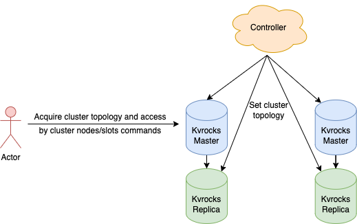

# Cluster

Before releasing the cluster mode of Kvrocks, we usually used the pre-sharding way to scale out the capacity like sharding with Twemproxy, and used Redis Sentinel to guarantee the availability. Although it works well in most scenes since the capacity of Kvrocks is far larger than Redis, it’s still trivial to scale-out in-flight, so we decided to implement the cluster mode to make it easier.

There are two main types of Redis cluster solutions in the industry:

* Redis cluster decentralized solution
* Codis centralized solution

For Redis cluster solution, the biggest advantage is NOT needing to depend on other components, but the shortcoming is also obvious that it's hard to write the right implementation and not easy to maintain the cluster topology. Another big issue is Gossip protocol would limit the cluster size.

For Codis solution, we need to introduce a proxy and centralized storage to keep the metadata, the proxy also added extra network communication cost and delay.

In Kvrocks cluster design, we want to integrate advantages of both solutions: that is, you can access Kvrocks without the proxy, and scale-out easily.

## Architect

Each Kvrocks node can act as Redis node which can offer the cluster topology directly, and the Redis cluster client can also work on the Kvrocks cluster without any modifications. The topology is managed by the other control panel component which can avoid the complexity of the Gossip protocol(Redis community takes many years to complete the Gossip on cluster solution).



## Topology management

Kvrocks uses the [CLUSTERX SETNODES](https://github.com/apache/kvrocks/pull/302) command to set up the cluster topology, be careful that we should apply the entire topology information to all nodes since nodes didn't communicate with each other. The command is like below:

```shell
CLUSTERX SETNODES $ALL_NODES_INFO $VERSION $FORCE
````

`$ALL_NODES_INFO` is the cluster topology information in format (note that newline is required between different nodes):

```shell
$node_id $ip $port $role $master_node_id $slot_range
```

where

- `$node_id`: 40 chars string, it represents as the unique id in the cluster
- `$ip` and `$port`: the node IP address and the listening port
- `$role`: node's role, should be one of `master` or `slave`
- `$master_node_id`: set to the master node id when the current node's role is a slave; `-` if it's master
- `$slot_range`: slots are served by current node, the format can be the range or single value, like `0-100 200 205`, which means slots 0 to 100, 200 and 205 are served by this node

`$VERSION` is the topology information version used to control update the order. The topology information can be updated iff the version is newer than the current version.

`$FORCE` (0 or 1) indicates force update the topology information without verifying the version, you can use this flag when the topology information is totally broken. For example:

```shell
CLUSTERX SETNODES "kvrockskvrockskvrockskvrockskvrocksnode1 10.32.68.251 6666 master - 0-5460 \n kvrockskvrockskvrockskvrockskvrocksnode2 10.32.68.250 6667 master - 5461-10992 \n kvrockskvrockskvrockskvrockskvrocksnode3 10.32.68.249 6666 master - 10993-16383" 1
```

Although Kvrocks can recognize the node id by comparing the `ip:port` pair then finding out the serving slots, but users may set the IP address to `0.0.0.0` so that we can't match the right topology information. Thus, Kvrocks gives the extra command [CLUSTERX SETNODEID](https://github.com/apache/kvrocks/pull/302) to set the id. The format is like this:

```shell
CLUSTERX SETNODEID $NODE_ID
```

`$NODE_ID` should be 40 chars unique id in cluster.

## Node management

Kvrocks cluster can be set up as simple as using those cluster commands, we even can write a script to watch and apply cluster changes. Those commands can be integrated into those companies which have their own cluster solution. Kvrocks also offers the `CLUSTERX VERSION` command to inspect current cluster topology information, the controller can force to update topology information when the version is out of date or wrong.

For a complete cluster solution, we need to depend on another controller to manage the topology information, failure detection, and failover. Kvrocks team is also developing the official controller to make the cluster manage and operate easier. But the manual resource is the bottleneck, welcome anyone who is interested in this project to build together.

## Client access

Users can use Redis Cluster SDK to access the Kvrocks cluster since it's compatible with the Redis cluster solution(Kvrocks supported `CLUSTER NODES` and `CLUSTER SLOTS` command to respond to the cluster topology).  Kvrocks also responds to the `MOVED $slot_id $ip:$port` to redirect the target node when the slot is NOT served by the current node. You can also use the Redis Cluster Proxy like `redis-cluster-proxy` to hide the cluster topology.

## Deploy and operate

Users need to self-manage the cluster topology information since the Kvrocks controller is still under development. The deployment steps are below:

1. Deploy Kvrocks nodes
2. Design the kvrocks topology which is mentioned at [topology management](#topology-management)
3. Set node unique id for each node by using `CLUSTER SETNODEID` command
4. Apply the topology information to all nodes by using `CLUSTER NODES` command

Kvrocks would auto-setup the master-slave replication after receiving the setup topology command, and repeats steps 2-4 when we want to switch the node role or number.

Currently, Kvrocks topology modification is based on full state, that's we need to sync the full topology information to each node, which may cause high network and cpu cost, but it can guarantee the correctness of the cluster. Also, the version-based modification can help us to achieve the increment modification if we want to do that, we would offer a way to add, update and delete nodes to make operation easier.

## Cluster command And safety

To guarantee the correctness of client SDK, we rename the `CLUSTER` command to `CLUSTERX` to prevent the topology can being modified casually, but we can still use the `CLUSTER` command to fetch the cluster topology information.

## Cluster scaling

Kvrocks data migration is based on the slot instead of on key like Redis, we can migrate one slot to another node at once.

Kvrocks storage is based on disk instead of memory, so the key migration may be time cost. Now, the controller/DBA can use `CLUSTER MIGRATE` command to migrate slots.

After `CLUSTERX MIGRATE` command to migrate the slot, you should use `CLUSTER SETSLOT` to modify the topology information:

```shell
CLUSTERX SETSLOT $slot NODE $node_id $new_version
```

* `$slot`: assign which slot to be migrated
* `NODE`: same as the Redis cluster setslot
* `$dest_nodeid`: which node of the slot is to be migrated
* `$new_version`: the version of the topology information, noted that the version MUST be newer than the old version, or the node would refuse to apply the modification.

For more information, see [PR-430](https://github.com/apache/kvrocks/pull/430).

## Summary

Kvrocks cluster implementation is compatible with the Redis cluster, in which users can use the Redis cluster client to access the Kvrocks cluster, also didn't have the extra proxy latency like the Codis solution.

By the way, Kvrocks cluster topology management and scaling have finished from 2.0.6. We will continue improving the visibility, operation, and cluster management, to make the cluster better and easier.

For the Kvrocks controller, the community is building the official [controller](https://github.com/KvrocksLabs/kvrocks_controller) to make the cluster management easier. Welcome anyone who is interested.
