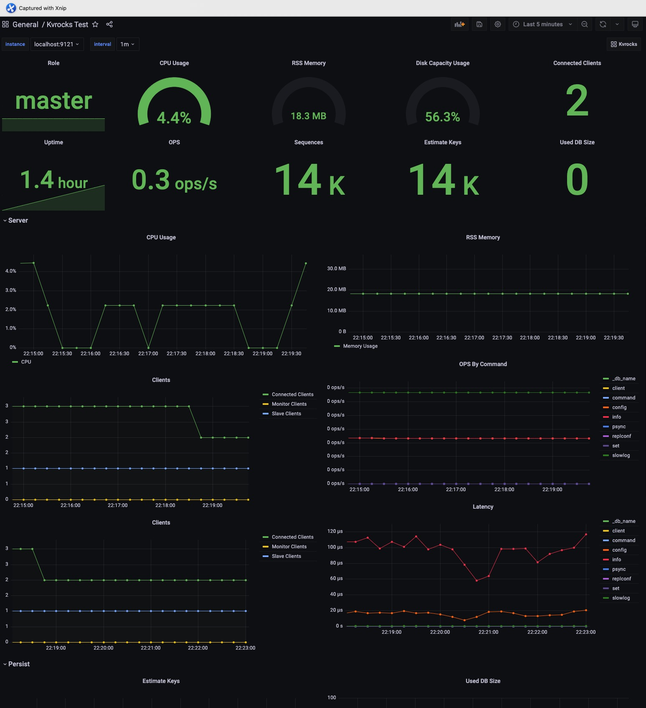

# Kvrocks Exporter

Like the Redis metrics monitor, Kvrocks also exports the internal metrics to INFO commands.

Users can collect and store those metrics, we also provide [the Kvrocks exporter](https://github.com/KvrocksLabs/kvrocks_exporter) for Prometheus metrics since it's widely used now.

Kvrocks Grafana dashboard template is available on Grafana.com. You can import the Dashboard with ID 15286 or downloads the JSON file:

```shell
wget https://grafana.com/api/dashboards/15286 -O kvrocks-dashboard.json
```

Example Grafana screenshots:


